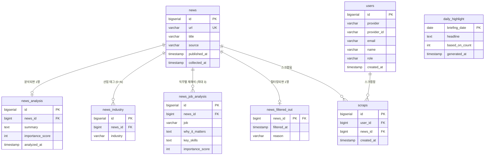

# 잡뉴스 (JobNews)

취준생을 위한 직무/산업 맞춤형 뉴스 브리핑 서비스

## 1. 프로젝트 소개

잡뉴스는 IT전산·데이터분석·백엔드 직무를 준비하는 취업준비생을 위해, 매일 쏟아지는
경제/산업 뉴스를 AI가 자동으로 수집하고 직무 관점에서 재해석해 보여주는 뉴스 브리핑
서비스입니다. 관심 직무 탭을 선택하면 같은 뉴스라도 그 직무에 왜 중요한지, 어떤
역량과 연결되는지를 함께 보여줍니다.

서비스 URL: https://newsbriefing.duckdns.org


*(스크린샷 자리 — 브리핑 화면, 직무 탭, 관리자 통계 대시보드 등 캡처 후 교체)*

## 2. 문제 정의

- **해결하고 싶은 문제**: 취준생이 산업/직무 관련 뉴스를 매일 훑어보기 번거롭고, 어떤
  뉴스가 자신의 지원 직무와 관련 있는지 판단하기 어렵다.
- **대상 사용자**: IT전산/데이터분석/백엔드 직무를 준비하는 취업준비생.
- **기대 효과**: 직무 관점으로 재해석된 뉴스를 매일 확인하고, 관심 있는 뉴스는
  스크랩해뒀다가 나중에 어떤 산업에 관심을 가졌는지 돌아볼 수 있다.

## 3. MVP 범위

### 핵심 기능

1. 뉴스 수집 파이프라인 (RSS 30분 주기 수집, URL 중복 제거)
2. AI 뉴스 구조화 (원문 미저장, 2단계 요약: 공통 요약과 직무별 재해석, importance_score)
3. 직무별 맞춤 브리핑 조회 (전체/IT전산/데이터분석/백엔드 탭 + 날짜 탐색)
4. 오늘의 흐름 (그날 상위 뉴스를 관통하는 공통 흐름 한 문장 요약)
5. GitHub/Google OAuth2 로그인 + 관리자 전용 통계 대시보드
6. 뉴스 스크랩 + 내 리포트 (스크랩 기반 관심 산업 대시보드)

### 이번 범위에서 제외한 기능

- **관리자용 뉴스 수동 검수 화면**: `GET /api/review/summaries`(요약 QA 조회) API는
  있지만 별도 화면은 없고 Swagger UI로만 확인할 수 있다.
- **채용 정보 연계, CS 지식 학습 콘텐츠**: 코드베이스에 흔적이 없는, 구상 단계
  아이디어다. 13절 참고.

### MVP 원칙

기능을 넓히기보다 수집, AI 구조화, 직무별 브리핑이라는 핵심 파이프라인 하나를
안정적으로 돌리는 데 먼저 집중했다. 로그인이나 통계, 스크랩처럼 그 위에 얹는
기능은 파이프라인이 EC2, HTTPS, 자동 배포까지 갖추고 안정화된 다음에 순서대로
붙였다.

## 4. 사용자 흐름

로그인하지 않아도 브리핑 조회 같은 핵심 기능은 다 쓸 수 있다. 로그인하면 관심
있는 뉴스를 스크랩해둘 수 있고, 스크랩이 쌓이면 "내 리포트"에서 그동안 어떤
산업에 관심을 가졌는지 확인할 수 있다. ADMIN 권한이 있는 계정은 관리자 통계
대시보드에도 들어간다.

```mermaid
flowchart TD
    A[사용자 접속] --> B[브리핑 화면: 직무 탭 · 날짜 이동으로 카드 조회]
    B --> C[카드의 스크랩 아이콘 클릭]
    C --> D{로그인 상태?}
    D -- 아니오 --> E[로그인 모달: GitHub / Google 선택]
    E --> F[OAuth2 로그인, 최초면 자동 회원가입]
    F --> C
    D -- 예 --> G[스크랩 추가/취소]
    F --> H["내 리포트 보기" 링크 노출]
    H --> I[/my-report: 요약 카드 · 산업 관심도 차트 · 최근 스크랩 목록]
    F --> J{role이 ADMIN인가?}
    J -- 예 --> K["관리자 통계" 링크 노출]
    K --> L[/admin: 5개 지표]
```

## 5. 주요 기능

### 뉴스 수집

RSS를 30분 주기(`collector.schedule.fixed-delay-ms: 1800000`)로 폴링해 전자신문
(`etnews`)과 연합뉴스 경제(`yna.co.kr/rss/economy`) 두 소스에서 제목/링크/발행일
메타데이터만 가져온다. `news.url`에 대한 애플리케이션 레벨 중복 체크(`existsByUrl`)와
DB `UNIQUE` 제약으로 중복 저장을 막는다. 이 단계에서는 본문을 건드리지 않는다.
과거에는 여기서 본문까지 크롤링했는데, 저작권 리스크 때문에 본문 크롤링은 AI
구조화 단계로 옮겼다(아래 참고). RSS 요청이 실패하면 최대 3회, 2초/4초/8초 간격으로
재시도한다.


*(스크린샷 자리 — 수집 스케줄 로그 또는 관리자 통계의 "일별 수집 건수" 차트)*

### AI 구조화

뉴스 본문은 DB 어디에도 저장하지 않는다. AI 구조화 단계(`NewsStructuringService`)가
분석 직전에 원문 URL을 그 자리에서 크롤링해서 메모리 변수로 잠깐 쓰고, 메서드가
끝나면 버린다. 복제권 리스크를 줄이려고 이렇게 설계했다.

구조화 앞에는 규칙 기반 1차 필터가 있다. LLM 호출 없이 값싼 비교만으로 거른다.
수집된 지 2일(`ai.structuring.max-age-days`)이 넘었거나, 제목에 "코스피/환율/
[부고]/로또" 같은 16개 제외 키워드 중 하나가 있거나, 크롤링한 본문이 200자
(`ai.filter.min-content-length`) 미만이면 OpenAI를 호출하지 않고 건너뛰고, 그
사유를 `news_filtered_out.reason`(`TOO_OLD`/`TITLE_EXCLUDED`/`CONTENT_TOO_SHORT`)에
남긴다.

필터를 통과하면 LLM을 2단계로 호출한다.

1. **1단계(공통 요약)**: 크롤링한 원문을 입력으로 사실 위주 공통 요약과
   `importance_score`(1~10점, 3개 직무/8개 산업과의 관련성만 기준으로 채점하고
   사회적 화제성은 명시적으로 배제), 관련 산업 태그를 만든다.
2. **2단계(직무별 재해석)**: 원문이 아니라 1단계의 요약을 입력으로, IT전산/
   데이터분석/백엔드 세 직무 각각의 관점에서 왜 중요한지, 핵심 역량은 뭔지와
   직무별 `importance_score`(1~10점, 직무 간 상대평가는 아님)를 만든다.

두 단계 모두 원문 문장을 그대로 옮기지 말고 사실관계만으로 새 문장을 쓰라고
프롬프트에 명시해뒀다. 배치는 매시간 정각(`openai.schedule.cron: 0 0 * * * *`)에
미분석 뉴스를 최대 20건씩 처리하고, `POST /api/structuring/run`으로 수동 즉시
실행도 가능하다.


*(스크린샷 자리 — Swagger UI의 구조화 응답 또는 직무별 재해석이 담긴 브리핑 카드)*

### 직무별 브리핑

`GET /api/briefings`가 `job`(전체/IT전산/데이터분석/백엔드)과 `date`(yyyy-MM-dd)
파라미터를 받는다. 날짜를 생략하면 오늘, job을 생략하면 공통 요약만 있는 전체
모드로 동작한다. 직무를 선택하면 그 직무의 `importance_score`가 8점
(`briefing.job-highlight-min-score`) 이상인 뉴스를 1순위(⭐)로 먼저 채우고,
남은 자리는 공통 점수 기준 2순위로 채운다. 화면에는 직무 탭 네 개와 날짜 이동
UI(◀/▶ 화살표 + 캘린더 아이콘, 오늘 이후는 선택 불가)가 있다.


*(스크린샷 자리 — 직무 탭 전환 및 날짜 이동 UI)*

### 오늘의 흐름

그날 브리핑 상위 10건(`briefing.top-n`, 직무별 브리핑과 정확히 같은 모집단)의
요약을 모아 공통 흐름을 한 문장으로 뽑아낸다. 재료가 3건(`daily-highlight.min-news-
count`) 미만이면 억지로 연결하지 않고 LLM을 아예 호출하지 않는다. 뉴스 구조화
(매시간)와는 분리된 독립 스케줄로 하루 세 번(08:30/13:30/18:30,
`daily-highlight.schedule.cron`) 계산해서 비용을 예측 가능하게 유지한다.


*(스크린샷 자리 — 브리핑 화면 상단의 "오늘의 흐름" 배너)*

### 로그인

GitHub/Google OAuth2 로그인을 지원한다. 별도 회원가입 절차 없이 최초 로그인
시점에 `users` 테이블에 계정이 자동으로 생긴다(provider와 provider_id 기준,
이메일로 자동 연동하면 계정 탈취 위험이 있어서 하지 않았다). 로그인 상태는
서버 세션이 아니라 HttpOnly 쿠키에 담은 JWT로 판단한다. `main` push마다 백엔드
컨테이너가 재생성되는 배포 구조라, 서버 세션을 쓰면 배포할 때마다 다들 로그아웃될
거라 이렇게 갔다. 헤더의 "로그인/회원가입" 버튼을 누르면 GitHub/Google 두 옵션이
담긴 모달이 뜬다.


*(스크린샷 자리 — 로그인 모달)*

### 스크랩

로그인한 사용자가 관심 있는 뉴스를 저장해두는 기능이다. `POST /api/scraps?newsId=`
로 추가하고 `DELETE /api/scraps/{newsId}`로 취소한다. `scraps` 테이블에
`UNIQUE(user_id, news_id)`를 걸어서 같은 뉴스를 두 번 스크랩할 수 없게 막았는데,
버튼을 실수로 두 번 눌러도 에러가 나면 곤란하니 서버는 그 상황을 감지하면
(`DuplicateKeyException`) 에러 대신 기존 스크랩을 그대로 돌려준다. 스크랩 취소도
마찬가지로, 애초에 스크랩한 적이 없는 뉴스를 취소해도 에러 없이 200을 반환한다.

브리핑 카드에서는 산업 배지가 있는 줄의 오른쪽 끝에 북마크 아이콘이 있다. 빈
북마크와 채워진 북마크를 짝으로 나타내는 이모지가 마땅치 않아서, 작은 인라인
SVG 하나로 stroke와 fill만 바꿔 두 상태를 표현했다. 로그인하지 않은 상태에서
누르면 "로그인 후 이용하십시오" 안내가 담긴 로그인 모달이 바로 뜬다.

### 내 리포트

스크랩한 뉴스를 근거로 어떤 산업에 관심을 가졌는지 보여주는 개인 대시보드다.
`/my-report` 경로에 있고, 로그인 상태면 헤더의 "내 리포트 보기" 링크로 들어갈 수
있다(role과 무관하게 로그인만 하면 보이는 링크라, 관리자 통계 링크와는 조건이
다르다). 관리자 통계 페이지와 같은 이유로 `React.lazy`로 분리해서, 이 페이지를
안 보는 방문자는 recharts를 내려받지 않는다.

구성은 세 부분이다. 총 스크랩 수, 관심 산업 수, 가장 많이 스크랩한 산업을 보여주는
요약 카드 세 개(새 API 없이 이미 불러온 응답에서 그냥 계산), `GET
/api/scraps/industries`로 만드는 산업 관심도 가로 막대 차트, 그리고 `GET
/api/scraps` 응답에 담긴 제목·발행일·산업 태그로 채우는 최근 스크랩 목록이다.
뉴스 한 건이 산업을 여러 개 가질 수 있는 구조(`news_industry`가 다대다)라서,
산업이 두 개 태깅된 뉴스를 스크랩하면 그 스크랩 하나가 두 산업 카운트에 동시에
반영된다. 주간이나 월간 스크랩 추이 같은 시계열은 일부러 넣지 않았다. 사용자
한 명, 스크랩 수십 건 규모에서 기간별로 쪼개면 빈 구간이 많아 보여서 오히려
휑해질 것 같았다.


*(스크린샷 자리 — 내 리포트 페이지: 요약 카드, 산업 관심도 차트, 최근 스크랩 목록)*

### 관리자 통계 대시보드

`role`이 `ADMIN`인 계정만 `/admin`에서 다섯 개 지표를 볼 수 있다. 산업별 뉴스
건수(파이 차트), 최근 14일 일별 수집 건수(라인 차트), 직무별 평균 중요도 점수
(막대 차트, 실제로 점수가 매겨진 뉴스만 집계), 필터링 사유별 건수(막대 차트),
최근 14일 일별 회원가입 추이(GitHub/Google 누적 막대). 접근 제어는 이중이다.
프론트는 ADMIN이 아니면 통계 API 자체를 호출하지 않고 "관리자만 접근 가능합니다"
문구만 보여주는데, 이건 UX 편의일 뿐이고 실제 방어선은 백엔드다.
`/api/stats/**`를 `hasRole("ADMIN")`으로 막아서 USER나 비로그인 요청은 리다이렉트가
아니라 403을 받는다.


*(스크린샷 자리 — 관리자 통계 대시보드 5개 카드)*

## 6. 기술 스택

### Frontend
- React 19 (Vite 8)
- Recharts (관리자 통계, 내 리포트 페이지 차트)
- 순수 CSS(프레임워크 없음, CSS 커스텀 프로퍼티로 라이트/다크 테마 대응)
- oxlint

### Backend
- Java 21 / Spring Boot 4.1.0
- MyBatis (`mybatis-spring-boot-starter`)
- Spring Security OAuth2 Client (GitHub/Google 로그인) + JJWT(JWT 발급/검증)
- Spring WebFlux `WebClient` + Reactor Netty (OpenAI API 호출)
- ROME (RSS 파싱), Jsoup (기사 본문 크롤링)
- springdoc-openapi (Swagger UI)

### DB
- PostgreSQL 16
- Flyway (스키마 버전 관리)

### Infra
- AWS EC2
- Docker Compose (db + backend + nginx)
- Nginx (정적 파일 서빙 + `/api`, `/oauth2`, `/login` 리버스 프록시 + HTTPS 종료)
- GitHub Actions (main push 시 SSH로 EC2에 접속해 자동 배포)
- Let's Encrypt(certbot) + DuckDNS (무료 도메인 + SSL 인증서)

## 7. 서비스 아키텍처

### 요청 흐름

```
[브라우저]
    │ HTTPS
    ▼
[Nginx 컨테이너] ── 정적 파일(React 빌드) 직접 서빙
    │ /api/**, /oauth2/**, /login/** 만 리버스 프록시
    ▼
[Spring Boot Backend 컨테이너]
    │ MyBatis
    ▼
[PostgreSQL 컨테이너]
```

nginx가 HTTPS를 종료하고 backend에는 평문 HTTP로 전달한다. backend가
`X-Forwarded-Proto` 헤더를 신뢰하도록 `server.forward-headers-strategy:
framework`를 설정해뒀다. db/backend 컨테이너는 호스트에 포트를 노출하지 않고,
nginx를 통해서만 외부에서 접근할 수 있다.

### 2단계 LLM 파이프라인

```
RSS 수집(메타데이터만)
    │
    ▼
[규칙 기반 1차 필터] 제목 키워드 / 본문 길이 / 수집 경과일
    │ (걸러지면 news_filtered_out에 사유만 기록, LLM 미호출)
    ▼
원문 크롤링 (메모리 한정, DB 미저장)
    │
    ▼
[1단계 LLM] 원문 → 공통 요약 + importance_score(1~10) + 산업 태그
    │
    ▼
[2단계 LLM] 1단계 요약(원문 아님) → 직무별(IT전산/데이터분석/백엔드) 재해석 + 직무별 점수
    │
    ▼
news_analysis / news_industry / news_job_analysis 저장
```

### 배치 스케줄러

```
뉴스 수집        : 30분마다               (collector.schedule.fixed-delay-ms)
AI 구조화        : 매시간 정각             (openai.schedule.cron, 최대 20건/회)
오늘의 흐름 계산  : 매일 08:30/13:30/18:30 (daily-highlight.schedule.cron, 구조화와 독립)
```

## 8. ERD



`scraps`가 `users`와 `news`를 잇는 다대다 관계 테이블이다. `UNIQUE(user_id,
news_id)`로 같은 사람이 같은 뉴스를 두 번 스크랩하는 걸 막는다. `daily_highlight`는
여전히 독립 테이블이다. 날짜별 집계 결과라 외래키로 연결할 대상이 없다.

## 9. API 명세 (핵심만)

전체 API는 Swagger UI(`/swagger-ui/index.html`)에서 확인할 수 있다. 아래는 핵심
엔드포인트만 발췌했다.

### GET /api/briefings

```
GET /api/briefings?job=백엔드&date=2026-08-27
```
```json
[
  {
    "newsId": 1123,
    "title": "OO기업, 대규모 언어모델 기반 사내 검색 시스템 도입",
    "url": "https://example.com/news/1123",
    "publishedAt": "2026-08-27T09:12:00",
    "summary": "OO기업이 사내 문서 검색에 LLM을 접목한 시스템을 도입했다고 밝혔다...",
    "importanceScore": 7,
    "industries": ["플랫폼/IT서비스"],
    "jobInsight": {
      "job": "백엔드",
      "whyItMatters": "대규모 검색 인프라 구축 경험이 백엔드 채용 요건과 직접 연결됩니다.",
      "keySkills": "분산 시스템, 벡터 검색, API 설계",
      "importanceScore": 8
    },
    "isJobHighlighted": true
  }
]
```
`job` 파라미터를 생략하면 `jobInsight`/`isJobHighlighted`는 `null`이다. 해당
날짜에 데이터가 없으면 빈 배열을 반환한다. 에러가 아니라 정상적인 빈 상태다.

### GET /api/auth/me

```json
{ "id": 3, "email": "user@example.com", "name": "홍길동", "role": "USER" }
```
로그인 상태가 아니면 401을 반환한다(본문 없음).

### POST /api/auth/logout

로그인 쿠키를 만료시킨다. 200, 본문 없음.

### POST /api/scraps

```
POST /api/scraps?newsId=1123
```
```json
{
  "id": 42,
  "newsId": 1123,
  "title": null,
  "url": null,
  "publishedAt": null,
  "createdAt": "2026-08-30T03:14:19.317201",
  "industries": []
}
```
로그인이 필요하다(비로그인이면 403). 스크랩 추가/취소 응답은 뉴스 조인을 생략해서
`title`/`url`/`publishedAt`/`industries`가 비어있다. 이미 스크랩한 뉴스를 다시
요청해도 에러 없이 같은 스크랩을 반환한다.

### DELETE /api/scraps/{newsId}

스크랩을 취소한다. 스크랩한 적이 없어도 에러 없이 200을 반환한다.

### GET /api/scraps

```json
[
  {
    "id": 42,
    "newsId": 1123,
    "title": "OO기업, 대규모 언어모델 기반 사내 검색 시스템 도입",
    "url": "https://example.com/news/1123",
    "publishedAt": "2026-08-27T09:12:00",
    "createdAt": "2026-08-30T03:14:19.317201",
    "industries": ["플랫폼/IT서비스"]
  }
]
```
로그인한 사용자의 스크랩 전체를 최신순으로 반환한다. 이번엔 뉴스와 조인해서
제목/URL/발행일/산업 태그까지 채워져 있다. 비로그인이면 403.

### GET /api/scraps/industries

```json
[
  { "industry": "플랫폼/IT서비스", "count": 3 },
  { "industry": "반도체", "count": 1 }
]
```
로그인한 사용자의 스크랩을 산업별로 묶은 건수다. 뉴스 한 건이 산업을 여러 개
가지면 그 스크랩 하나가 여러 산업 카운트에 동시에 반영된다.

### GET /api/stats/industries (관리자 전용)

```json
[
  { "industry": "플랫폼/IT서비스", "count": 508 },
  { "industry": "공공/정부", "count": 175 }
]
```
`role`이 `ADMIN`이 아닌 사용자(비로그인 포함)가 `/api/stats/**`를 호출하면 403을
반환한다.

## 10. AI 코딩 에이전트 활용 방식

이 프로젝트는 처음부터 끝까지 Claude Code를 SDD(Specification-Driven
Development) 방식으로 활용해 만들었다. `AGENTS.md`에 프로젝트 전역 규칙을
고정해두고(불필요한 라이브러리 금지, 시크릿 하드코딩 금지, 큰 변경 전 계획 먼저,
트러블슈팅 자동 기록 등) 매 기능마다 같은 순서를 반복했다.

```
문제 정의 → 설계(Plan Mode) 요청 → 설계 검토/승인 → Phase별 구현
→ 로컬 실제 서버로 검증(curl/DB 직접 조회) → 트러블슈팅 자동 기록
→ (필요시) EC2 배포 후 재검증 → main merge
```

새 브랜치에서 작업하게 하고, 코드부터 쓰게 하지 않았다. 항상 설계안을(수정/신규
파일 목록, Phase 분리, 검증 계획 포함) 먼저 보여주게 한 다음 승인하고 진행하는
식이었다. 빌드/테스트 결과나 curl 응답 같은 실제로 확인된 근거 없이는 구현
완료라고 보고하지 않게 했다. 예상 밖의 에러나 워크어라운드가 생기면 그 자리에서
바로 `docs/troubleshooting.md`에 현상, 원인, 해결 형식으로 기록하게 했는데, 그렇게
쌓인 트러블슈팅이 지금 33건이다.

**나쁜 요청 예**: "로그인 기능 추가해줘"

세션 방식(서버 세션 vs JWT), 시크릿 처리, 브랜치 전략, DB 스키마 변경 방식까지
아무 제약이 없다. 에이전트가 임의로 판단해야 하는 부분이 너무 많아서, 결과가 이
프로젝트의 실제 배포 구조(컨테이너 재생성형 배포)와 안 맞을 위험이 크다.

**좋은 요청 예**: (실제 사용한 요청 요약) "GitHub/Google OAuth2 로그인을
추가한다. 새 `users` 테이블은 Flyway 마이그레이션으로. 세션 방식은 이 프로젝트
규모(EC2 단일 서버)에 뭐가 적합한지 판단해서 제안해줘. Client ID/Secret은
절대 코드에 하드코딩하거나 나에게 요청하지 말고, 필요한 환경변수 이름만 알려주면
내가 직접 .env에 넣는다. 새 브랜치에서 작업하고 Phase를 나눠서 진행."

무엇을 만들지, 무엇을 판단해서 제안할지, 무엇은 절대 하면 안 되는지가 각각
분리돼 있다. 에이전트가 엉뚱한 방향으로 갈 여지가 크게 줄었다.

## 11. 트러블슈팅 기록

전체 기록은 [`docs/troubleshooting.md`](./docs/troubleshooting.md)에 33건이
현상, 원인, 해결 형식으로 남아있다. 그중 임팩트가 컸던 다섯 개만 옮겨본다.

### 크롤링 원문을 DB에 영구 저장하던 구조를 저작권 리스크 완화를 위해 재설계

크롤링한 기사 원문 전체를 `news.description` 컬럼에 영구 저장하고, LLM이 그
원문으로 공통 요약과 직무별 재해석을 한 번의 호출로 같이 만들고 있었다. 원문을
무기한 DB에 두는 것 자체가 복제권 문제 소지가 있었다.

원인을 따져보니, 설계할 때 "AI 입력 재료는 어딘가에 저장돼 있어야 한다"고
암묵적으로 가정하고 크롤링 단계와 LLM 호출 단계를 시점을 나눠서 만든 게 문제였다.
그 사이에 원문이 DB에 계속 남게 됐다.

크롤링을 수집 단계에서 완전히 빼고 AI 구조화 단계로 옮겼다. 뉴스를 처리할 때마다
그 자리에서 크롤링해서 지역 변수로만 쓰고 버리게(DB 미저장) 다시 짰다. LLM 호출도
1단계(원문 → 공통 요약)와 2단계(1단계 요약 → 직무별 재해석)로 나눠서, 원문이
2단계까지 넘어가지 않게 했다. `news.description` 컬럼은 아예 지웠다.

### 브리핑 날짜 판단 기준을 "AI 분석일"에서 "기사 발행/수집일"로 변경

날짜 탭으로 과거 브리핑을 조회하면 그 날짜와 발행일이 며칠씩 차이 나는 기사들이
섞여 나왔다. 8/21 탭인데 8/18~8/20에 발행된 기사가 같이 뜨는 식이었다.

"오늘의 브리핑"을 판단하는 기준이 `news_analysis.analyzed_at`, 그러니까 AI가
언제 처리했는지였던 게 원인이다. 과거 백로그를 한꺼번에 재처리한 이력 때문에
분석일은 같아도 실제 발행일은 제각각인 기사가 많이 섞여 있었다.

판단 기준을 `COALESCE(news.published_at, news.collected_at)`으로 바꿨다. RSS에
발행일이 안 오면 수집일로 대체한다. "오늘의 브리핑"은 AI가 오늘 처리한 게
아니라 오늘 일어난 일을 보여줘야 한다는 개념을 코드에 정확히 반영한 셈이다.

### 처리 용량이 실제 수집량을 못 따라가 최신 뉴스가 계속 뒤로 밀림

뉴스를 30분마다 수집해도 브리핑에는 최신 뉴스가 안 보였다. 오래된 미분석
백로그를 한 번 수동으로 비워도 며칠 지나면 같은 문제가 다시 생겼다.

미분석 뉴스를 오래된 순(FIFO)으로 처리하는데, 처리 용량은 하루 3회 x 20건 = 60건으로
고정돼 있었다. 실측한 실제 수집량은 하루 평균 120건, 처리 용량의 딱 두 배였다.
매일 약 60건씩 백로그가 순증하는 구조라 한 번 비워도 며칠 뒤 다시 쌓였던 거다.

AI 구조화 배치 스케줄을 하루 3회에서 매시간(24회)으로 늘려서 처리 용량을 하루
480건으로 확보했다. 실측 수집량 대비 4배 여유다. 배치가 돌아도 밀린 게 없으면
바로 0건으로 끝나니까(처리한 만큼만 과금) 비용은 그대로고 지연만 없어졌다.

### 수동 ALTER TABLE 누락으로 인한 장애를 계기로 Flyway 도입

DB 스키마 변경을 코드 배포와 따로, EC2에서 직접 `ALTER TABLE`을 실행하는
방식이었는데, 이걸 깜빡해서 다음 날 배치가 컬럼이 존재하지 않는다는 에러로 계속
500을 냈다.

스키마 변경이 배포 파이프라인 밖에서 사람이 기억해서 따로 실행하는 명령으로
존재했던 게 근본 원인이었다. `docker compose ps`의 healthy 상태만 봐서는 이
컬럼이 실제로 생겼는지 알 방법이 없었다. healthcheck가 그 테이블을 안 건드리는
경로였기 때문이다.

Flyway를 도입해서 `db/migration/V1__baseline.sql`부터 버전 관리를 시작했다.
이제 스키마를 바꾸려면 새 마이그레이션 파일을 추가하기만 하면 되고, 앱이
재기동될 때 자동으로 적용된다. 로컬이나 EC2 어느 한쪽에 적용을 깜빡하는 사고
자체가 구조적으로 안 생기게 됐다.

### 요약 길이를 늘리려는 프롬프트 지시가 사실 오류와 할루시네이션을 유발

요약을 원문과 직접 대조해봤더니 두 가지가 걸렸다. 행위 주체가 "전주시"에서
"정부"로 바뀌어 있었고, 요약 마지막 문장엔 원문에 없는 전망("향후 다른
지자체에도 영향")이 그럴듯하게 붙어 있었다.

요약 길이를 늘리는 과정에서 "맥락/시사점 요소가 원문에 없어도 최소 1문장은
반드시 작성하라"고 지시했는데, 이게 사실상 없는 내용을 만들어내라는 요청과
다름없었다. 주체를 정확히 유지하라는 제약도 애초에 프롬프트에 없었다.

프롬프트에 길이보다 우선하는 정확성 규칙 두 가지를 추가했다. 주체를 원문과
다르게 바꾸거나 일반화하지 말 것, 원문에 없는 전망이나 시사점을 추측해서 붙이지
말 것. 맥락/시사점 요소는 원문에 실제로 그런 내용이 있을 때만 쓰게 제한했다.
같은 기사로 다시 처리해보니 주체가 정확히 유지되고 근거 없는 문장도 사라졌다.
다만 요약 평균 길이는 좀 줄었다. 정확성을 길이보다 우선하기로 한 거니 감수할
만한 트레이드오프였다.

## 12. 회고

### 잘된 점

핵심 파이프라인부터 안정화하고 로그인이나 통계 같은 부가 기능을 나중에 얹은
순서가 맞았던 것 같다. 매 기능마다 실제 서버로 검증하게 한 덕분에 curl 응답이나
SQL 조회 결과 없이 구현 완료라고 넘어간 적이 한 번도 없다. 트러블슈팅을 그때그때
기록해둔 것도 도움이 됐다. EC2 재배포가 성공한 것처럼 보이는데 실제로는 예전
코드가 계속 도는 문제처럼, 비슷한 증상이 다시 나타났을 때 기록을 보고 원인을
훨씬 빨리 좁힐 수 있었다.

### 어려웠던 점

로컬은 Windows에다 항상 한국 시간이라 잘 돌아가던 코드가 EC2(Docker, 기본
UTC)에 배포하자마자 시간대, 메모리, 디스크 같은 인프라 디테일에서 계속
문제가 터졌다. "컨테이너가 healthy로 뜬다"는 게 "방금 배포한 코드로 정상
동작한다"를 보장하지 않는다는 걸 여러 번 다른 모습으로 겪었다. 디스크 부족으로
재빌드가 조용히 실패한 적도 있고, 스키마 컬럼이 빠진 채로 배포된 적도 있었다.
AI 구조화 프롬프트도 한 번에 완성되지 않았다. 사회적 화제성과 직무 관련성을
헷갈리거나 할루시네이션이 섞이는 걸 사람이 직접 결과를 읽어가며 여러 차례
고쳐야 했다.

### 배운 점

에이전트에게 요청할 때 하지 말아야 할 것과 판단을 맡길 부분을 나눠서 줄수록
결과 방향이 정확해진다는 걸 몸으로 느꼈다. "일단 되게만 해줘"보다 "이 프로젝트
배포 구조에서 세션 방식으로 뭐가 맞는지 판단해서 제안해줘"처럼 판단 기준까지
같이 주는 편이 훨씬 나았다. 그리고 "컨테이너가 떠 있다"와 "기능이 실제로
동작한다"는 다른 질문이라는 걸 배포 사고를 몇 번 겪으면서 계속 다시 배웠다.

## 13. 향후 개선 방향

- **채용 정보 연계, CS 지식 학습 콘텐츠**: 아직 아이디어 단계고 코드베이스엔
  흔적이 없다. 시기는 따로 정해두지 않았다.
- **스크랩 추이 시계열**: 내 리포트를 설계할 때 한 번 고려했다가 뺐다. 지금처럼
  사용자 한 명, 스크랩 수십 건 규모에서 기간별로 쪼개면 빈 구간이 많아져서
  오히려 데이터가 부실해 보일 것 같았다. 스크랩이 훨씬 많이 쌓이면 다시
  검토할 만하다.
- **스크랩 목록 페이지네이션**: 지금은 `GET /api/scraps`가 전체를 한 번에
  반환한다. 스크랩이 몇백 건 단위로 늘어나면 그때 커서 기반 페이지네이션을
  붙이는 게 맞을 것 같다.
